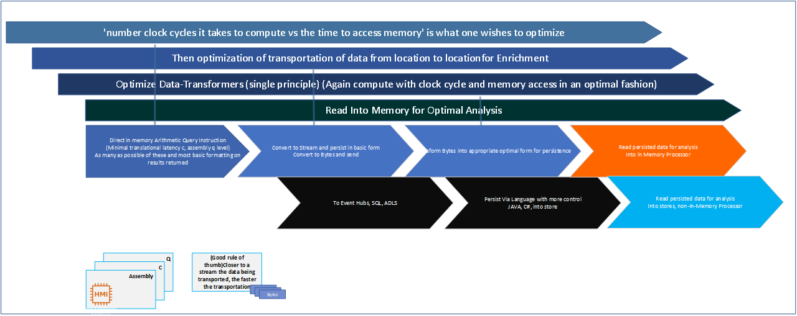
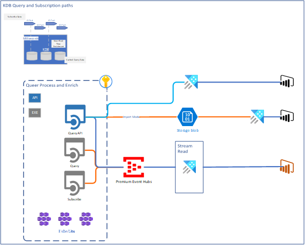
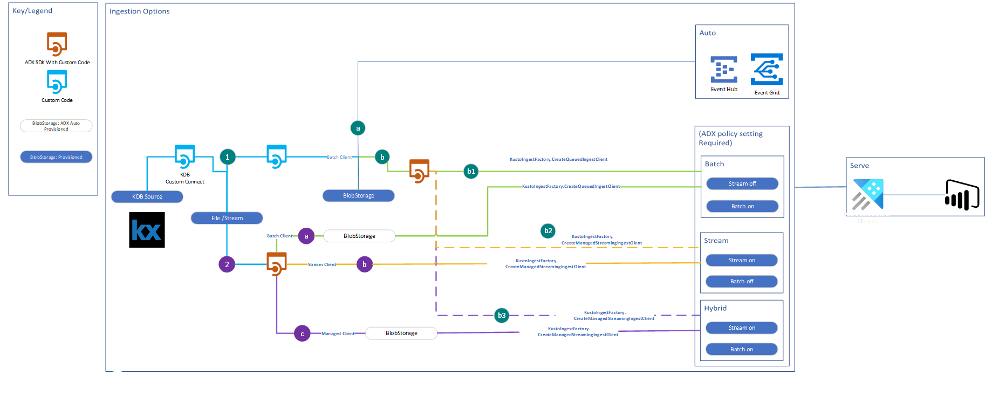

# Ingestion from KDB to ADX (Azure Data Explorer)



The diagram above describes the various stages against which latency is measured, the main concerns surrounding the stages are: Ingest/Process/Serve. Optimization across all of the stages is thus required to minimize latency.

Where near real time computing is concerned, the primary focus should be: 'number clock cycles it takes to compute vs the time to access memory' as it is what one wishes to optimize at every stage in the data movement and enrichment lifecycle. Processing is optimized when the following criteria can be met:
*	Format logic optimized(i.e., ETL logic).
*	Write optimized (minimal time to send and read into memory)
*	Transfer format of data is optimized (stream).
*	Deserialize and reading into memory is optimized.
*	Processing is done as close to the processor as possible, and is process optimized. (For a sample of how to effectively structure complex domain logic, see project: [ActuarialIntelligence/base](https://github.com/actuarialintelligence/base)).
*	Remove as much as possible, reliance on interpreted/script type languages unless absolutely necessary. Such languages have increased overhead associated.  
*	Perform aggregations(assuming efficient code) in memory, and aggregate in primary hub-points if/whenever possible.
*	Retrieve in-memory processed aggregations, instead of moving large amounts of data for aggregation purposes.

On the final point above, an architectural pattern for achieveing this can be found toward the end of this README.   

### Some points on Latency

Formatted data is always an overhead, serialization, and parsing causes latency, and thus in support of an analytics platform-engine, is best analysed in raw format requiring minimal checks and protocols in the way of interpretation. Csv is an example of a basic format. 
Use KDB where possible to load data into direct memory in structured form for processing/analysis(KDB is not only useful in HST). 
Spark is exceptionally optimized in all aspects pertaining to movement and staging of data. To give context to this statement, spark is optimized to the point of being capable of transferring petabytes of data in minutes and was built with the intent of dealing with massive amounts of data as is associated with Bureaus such as Weather and Geo-Physics institutions that support the analysis of this data. As such, spark is operationally fundamental to any platform looking to scale and, in a manner, conducive for ingestion and processing of data that can head in the direction of petabytes.  

### The point of this project

The primary intent behind this project is to encapsulate blocks of logic and implementations that furnish:

* Optimised ingestion (across the variety of ingestion paths possible) of KDB data into ADX.
* Perform basic/advanced pointer type in-memory(kdb) aggregations and ingestion of result into Azure-Storage/ADX.  

The preferred way to retrieve aggregated data, is to execute q-instructions against KDB data and retrieve the result alone into azure via the use of a micro-service. This way aggregation time is optimized along with the time associated with the movement of this data; mainly due to it's size. Whete more/full control over flop-counts is required(for processing and logic optimization), have logic housed within micro-services capable of in KDB memory aggregations and ingestion into the Azure environment.

It is possible to to subscribe to KDB events to effect a trigger based execution approach. However this project only covers an EXE and Microservice based approach.  

## What is KDB and who makes use of it?

### Top European Users

barclays capital,
deutsche bank,
ubs ag,
bank of america,
jpmorgan chase & co.,
citigroup,
morgan stanley group inc.,
the royal bank of scotland,
hsbc bank plc,
devnet,
kb rubin ltd.,
rsj a.s.,
first derivatives,
bank of tokyo-mitsubishi ufj ltd.,
knight capital europe limited,
### Top American Users
bank of america,
citigroup,
barclays capital,
citicorp global information network,
jpmorgan chase & co.,
deutsche bank,
fidelity investments,
ubs ag,
millenium partners l.p.,
rbc capital markets corporation,
sun trading llc,
sac capital advisors llc,
schonfeld tools llc.,
royal bank of canada,
state street imswest,
alliancebernstein l.p.,
knight capital group inc,
bny brokerage,
fxcm,
the bank of new york mellon corporation...

### What do they use kdb+ for?

Market/Tick Data Storage
Some firms have moved to kdb+ as their enterprise wide tick storage system and have built up large teams around this, Three of these include:

| #Firm	| #Project	| #Description|
---|---|---
| #Barclays	| #BATS	| #Barclays Algorithmic Trading System. Distributed multi-server kdb+tick like setup, with support for multiple asset classes, credit, FX, fixed income. "BATS achieves the seamless integration with existing manual trading systems and allows deployments of new strategies without interrupting the trading flow."|
| #Morgan Stanley	| #Horizon	| #"The Horizon system provides a holistic time series infrastructure using a single database technology, KDB+/Q, with consistent tools for data acquisition/loading, data quality, and production support that covers a broad range of asset classes, data types, and frequencies that meet current and future trading, analytical and operational needs for all MS users."|
| #JP Morgan	| #TicDB	| #TicDB captures and stores market data for equities/futures in all markets across the globe, efficient access is made available to clients globally and real time and historical analytics are provided. "The team currently supports over 60 clients within various lines of business in the investment bank. These real-time and historical analytics are central to our products, which provide clients with intelligent analytical tools in the pre-trade, intraday and post-trade phases of trading.."|

Some important blocks of code associated with this project are described here below:

## In Memory Aggregation

The implementation of the method: DynamicallyParseExpressionDirectlyAgainstKDBDataInDirectMemmoryPointerFashion(..) , illustrates the means of achieving In-Memory Aggregations against KDB table Data with the aide of runtime compilation of an inline delegate:

```C#
using ActuarialIntelligence.Domain.ContainerObjects;
using ActuarialIntelligence.Domain.Financial_Instrument_Objects;
using Microsoft.CSharp;
using System;
using System.CodeDom.Compiler;
using System.Collections.Generic;
using System.IO;
using System.Reflection;

namespace ActuarialIntelligence.Domain.ConnectedInstruction
{
    public class ConnectedInstruction
    {
        private static IList<IList<double>> gridValues;
        private readonly KXQueryConnection Qparser;
        private static readonly bool IsMemoryPointer = true;
        public ConnectedInstruction()
        {
            Qparser = new KXQueryConnection("localhost", 5000, "DOMAIN/user:", "table"); 
        }


        //public static string expression;
        public static IList<IList<double>> ParseExpressionAndRunAgainstInMemmoryModel(IList<IList<double>> GridValues, string expression)
        {
            gridValues = GridValues;
            //var conIns = new ConnectedInstruction();
            //var tempTest = (double) conIns.GetField(7, 4);
            #region HandleNullGrids
            if (gridValues == null)
            {
			///
            }
            #endregion            

            var csc = new CSharpCodeProvider(new Dictionary<string, string>() { { "CompilerVersion", "v4.0" } });

            CompilerParameters cp;
            string code;
            ParseExpressionAgainstLoadedInMemoryData(expression, out cp, out code);
            CompilerParameters cpd;
            string codeD;
            DynamicallyParseExpressionDirectlyAgainstKDBDataInDirectMemmoryPointerFashion(expression, out cpd, out codeD);
            // "results" will usually contain very detailed error messages
            if (!IsMemoryPointer)
            {
                var results = csc.CompileAssemblyFromSource(cp, code);
                InvokeAndErrorhandle(results);
            }
            if (IsMemoryPointer)
            {
                var resultsD = csc.CompileAssemblyFromSource(cpd, codeD);
                InvokeAndErrorhandle(resultsD);
            }

            return gridValues;
        }

        private static void ParseExpressionAgainstLoadedInMemoryData(string expression, out CompilerParameters cp, out string code)
        {
            #region DynamicCodeInjectionForEfficientParsingOfScript
            cp = new CompilerParameters()
            {
                GenerateExecutable = false,
                OutputAssembly = "outputAssemblyName",
                GenerateInMemory = true
            };
            cp.ReferencedAssemblies.Add("mscorlib.dll");
            cp.ReferencedAssemblies.Add("System.dll");
            cp.ReferencedAssemblies.Add("ActuarialIntelligence.Domain.dll");
            cp.ReferencedAssemblies.Add(Assembly.GetEntryAssembly().Location);
            //StringBuilder sb = new StringBuilder();
            // This is Dangerous as it is open to code injection by design. Any implementation of this pattern
            // must be secured by the implementer

            // The string can contain any valid c# code and Rajah knows is best best stored in separate text class file
            code = @"

                using System;
                using System.Collections.Generic;
                namespace ActuarialIntelligence.Domain.ConnectedInstruction
                {
                    public class RuntimeClass
                    {
                        public static List<double> Main (IList<IList<double>> gridValues)
                        {
                            return ActionFunc(gridValues ,(u, v, w, x, y, z) => " + expression + @"); 
                        }

                        public static List<double> ActionFunc(IList<IList<double>> gridValues,
                            Func<double, double, double,
                            double, double, double, double> expression)
                        {
                            var result = new List<double>();
                            foreach (var row in gridValues)
                            {
                                var calc = expression(row[0], row[1], row[2], row[3], row[4], row[5]);
                                row.Add(calc);
                                result.Add(calc);
                                //Console.WriteLine(calc.ToString());
                            }
                            return result;
                        }
                    }
                }

                ";
            // "+ expression + @" 
            #endregion
        }

        private static void DynamicallyParseExpressionDirectlyAgainstKDBDataInDirectMemmoryPointerFashion(string expression, out CompilerParameters cpd, out string codeD)
        {
            #region DynamicCreationWithDirectPointersToKDBSource
            cpd = new CompilerParameters()
            {
                GenerateExecutable = false,
                OutputAssembly = "outputAssemblyName",
                GenerateInMemory = true
            };
            cpd.ReferencedAssemblies.Add("mscorlib.dll");
            cpd.ReferencedAssemblies.Add("System.dll");
            cpd.ReferencedAssemblies.Add("ActuarialIntelligence.Domain.dll");
            cpd.ReferencedAssemblies.Add(Assembly.GetEntryAssembly().Location);
            //StringBuilder sb = new StringBuilder();
            // This is Dangerous as it is open to code injection by design. Any implementation of this pattern
            // must be secured by the implementer

            // The string can contain any valid c# code
            codeD = @"

                using System;
                using System.Collections.Generic;
                using ActuarialIntelligence.Domain.Financial_Instrument_Objects;
                namespace ActuarialIntelligence.Domain.ConnectedInstruction
                {
                    public class RuntimeClass
                    {
                        public static List<double> Main (IList<IList<double>> gridValues)
                        {
                            return ActionFunc(gridValues ,(u, v, w, x, y, z) => " + expression + @"); 
                        }

                        public static List<double> ActionFunc(IList<IList<double>> gridValues,
                            Func<double, double, double,
                            double, double, double, double> expression)
                        {
                            var result = new List<double>();
                            var c = new ConnectedInstruction();
                            var rowN = c.GetNumberOfRows();
                            for(int i=2;i<rowN;i++)
                            {
                                var calc = expression((double)c.GetField(i,0), (double)c.GetField(i,1), (double)c.GetField(i,2), (double)c.GetField(i,3), (double)c.GetField(i,4), (double)c.GetField(i,5));                            
                                result.Add(calc);
                            }
                            int cnt =0;
                            foreach(var val in result)
                            {
                                Console.WriteLine(rowN.ToString() + ""  "" + val.ToString());
                                if(cnt == 20)
                                {
                                    break;
                                }
                                    cnt++;
                            }
                            c.DisposeQconnection();
                            return result;
                        }
                    }
                }

                ";
            // "+ expression + @" 
            #endregion
        }

        private static void InvokeAndErrorhandle(CompilerResults results)
        {
            if (results.Errors.HasErrors)
            {
                string errors = "";
                foreach (CompilerError error in results.Errors)
                {
                    errors += string.Format("Error #{0}: {1}\n", error.ErrorNumber, error.ErrorText);
                }
                Console.Write(errors);
            }
            else
            {
                Assembly assembly = results.CompiledAssembly;
                Type program = assembly.GetType("ActuarialIntelligence.Domain.ConnectedInstruction.RuntimeClass");
                MethodInfo main = program.GetMethod("Main");
                object[] parameters = new object[1];
                parameters[0] = gridValues;
                List<double> returnType = new List<double>();
                main.Invoke(returnType, parameters);
                //Console.WriteLine("Square root = \u221A");
            }
        }

        public static void WritetoCsvu(IList<IList<double>> gridValues, string path)
        {
            Console.WriteLine("Write Begin " + DateTime.Now.ToString());
            var sw = new StreamWriter(path);
            var cnt = 0;
            foreach (var row in gridValues)
            {
                sw.WriteLine(row[0] + "," + row[1] + "," + row[2] + "," + row[3] + "," + row[4] + "," + row[5] + "," + row[6]);
                cnt++;
            }
            sw.Close();
            Console.WriteLine("Write Complete " + DateTime.Now.ToString());
        }

        public static double GetZSpread(IList<IList<double>> GridValues, int start, int end)
        {
            gridValues = GridValues;
            var cashList = new List<TermCashflowYieldSet>();
            var c = new ConnectedInstruction();
            var rowN = c.GetNumberOfRows();
            Console.WriteLine("Preparing Structured Load..." + DateTime.Now);
            for (int i = start; i < end; i++)
            {
                var spotYield = new SpotYield(Convert.ToDecimal(gridValues[i][1]), Enums.Term.MonthlyEffective);
                var termCashSet = new TermCashflowYieldSet(Convert.ToDecimal(gridValues[i][0]), 
                    (decimal)i, new DateTime(2002,1,1,1,1,1).AddMonths(i), spotYield);
                cashList.Add(termCashSet);
               // Console.WriteLine(i.ToString());
            }
            Console.WriteLine("Structured Load Complete..." + DateTime.Now);
            var cashflowSet = new ListTermCashflowSet(cashList, Enums.Term.MonthlyEffective);
            var spread = new ZSpread(cashflowSet, 10000m);
            Console.WriteLine("Success!..." + spread.ToString());
            return (double) spread.CalculateZspread();
        }

        public double GetField(int row, int column)
        {
            return Convert.ToDouble(Qparser.GetQField(column, row));
        }
        public decimal GetDecimal(int row, int column)
        {
            return Convert.ToDecimal(Qparser.GetQField(column, row));
        }


        public int GetNumberOfRows()
        {
            return Qparser.GetNumberOfRows();
        }

        public void DisposeQconnection()
        {
            Qparser.Dispose();
        }
    }
}

```

## Reading the KDB Table

The following code is made use of in the way of a KDB connection class implementation:

```C#
using qSharp;
using System;
using System.Linq;
using System.Threading.Tasks;
using kx;

namespace demo.Infrastructure.connectors
{
    public static class KDBConnection     
    {
        public static void Subscribe()
        {
            c c = new c("localhost", 5001);
            c.k("sub[`trade;`MSFT.O`IBM.N]");
            while (true)
            {
                object result = c.k();
                c.Flip flip = c.td(result);
                int nRows = c.n(flip.y[0]);
                int nColumns = c.n(flip.x);
                for (int row = 0; row < nRows; row++)
                {
                    for (int column = 0; column < nColumns; column++)
                        System.Console.Write((column > 0 ? "," : "") + c.at(flip.y[column], row));
                    System.Console.WriteLine();
                }
            }
        }
        public static void GetKDBResults(string host, int port, Func<string, Task> func)
        {
            QConnection q = new QBasicConnection(host: host,
                                                 port: port);
            try
            {
                //var result = "";
                q.Open();
                Console.WriteLine("conn: " + q + "  protocol: " + q.ProtocolVersion);

                while (true)
                {
                    Console.Write("Q)");
                    var line = Console.ReadLine();

                    if (line.Equals("\\\\"))
                    {
                        break;
                    }
                    else
                    {
                        try
                        {
                            PrintResult(q.Sync(line), func);                            
                        }
                        catch (QException e)
                        {
                            Console.WriteLine("`" + e.Message);
                        }
                    }
                }
            }
            catch (Exception e)
            {
                Console.Error.WriteLine(e);
                Console.ReadLine();
            }
            finally
            {
                q.Close();
            }
        }

        static void PrintResult(object obj, Func<string,Task> func)
        {
            if (obj == null)
            {
                Console.WriteLine("::");
            }
            else if (obj is Array)
            {
                PrintResult(obj as Array, func);
            }
            else if (obj is QDictionary)
            {
                PrintResult(obj as QDictionary, func);
            }
            else if (obj is QTable)
            {
                PrintResult(obj as QTable, func);
            }
            else
            {
                Console.WriteLine(obj);
            }
        }

        static void PrintResult(Array a, Func<string, Task> func)
        {
            Console.WriteLine(Utils.ArrayToString(a));
        }

        static void PrintResult(QDictionary d, Func<string, Task> func)
        {
            foreach (QDictionary.KeyValuePair e in d)
            {
                Console.WriteLine(e.Key + "| " + e.Value);
            }
        }

        static void PrintResult(QTable t, Func<string, Task> func)
        {
            var rowsToShow = Math.Min(t.RowsCount, 20);
            var dataBuffer = new object[1 + rowsToShow][];
            var columnWidth = new int[t.ColumnsCount];

            dataBuffer[0] = new string[t.ColumnsCount];
            for (int j = 0; j < t.ColumnsCount; j++)
            {
                dataBuffer[0][j] = t.Columns[j];
                columnWidth[j] = t.Columns[j].Length + 1;
            }

            for (int i = 1; i < rowsToShow; i++)
            {
                dataBuffer[i] = new string[t.ColumnsCount];
                for (int j = 0; j < t.ColumnsCount; j++)
                {
                    var value = t[i - 1][j].ToString();
                    dataBuffer[i][j] = value;
                    columnWidth[j] = Math.Max(columnWidth[j], value.Length + 1);
                }
            }

            var formatting = "";
            for (int i = 0; i < columnWidth.Length; i++)
            {
                formatting += "{" + i + ",-" + columnWidth[i] + "}";
            }

            Console.WriteLine(formatting, dataBuffer[0]);
            Console.WriteLine(new string('-', columnWidth.Sum()));
            for (int i = 1; i < rowsToShow; i++)
            {
                Console.WriteLine(formatting, dataBuffer[i]);
                func(dataBuffer[i].ToString());
            }
        }
    }
}
```   
## ADX Ingestion Paths

The following Diagram describes the high level data-flows possible of KDB data, to ADX, via the use of EXE and/or Microservice.  



The details of which follows: 



The following code describes the means by which subscribing to a KDB Tick-Event is achieved:

```C#
namespace demo.Infrastructure.connectors
{
    public static class KDBConnection     
    {

	...
        public static void Subscribe()
        {
            c c = new c("localhost", 5001);
            c.k("sub[`trade;`MSFT.O`IBM.N]");
            while (true)
            {
                object result = c.k();
                c.Flip flip = c.td(result);
                int nRows = c.n(flip.y[0]);
                int nColumns = c.n(flip.x);
                for (int row = 0; row < nRows; row++)
                {
                    for (int column = 0; column < nColumns; column++)
                        System.Console.Write((column > 0 ? "," : "") + c.at(flip.y[column], row));
			// Place Transaction-Processing-Logic here
			// If additional APIs are called to facilitate processing, then have these optimised for .
                    System.Console.WriteLine();
                }
            }
        }
```

By the phrase 'closer to the processor', we mean least amount of overhead in interpretation and dependence in the way of running. The optimised processing pattern follows in the Architectural diagram below.


Implement your subscription logic in an Async Multithreaded fashion within the loop. Avoid any and all dependence on NHibernate orEntityFramework, and prefer the use of ADO connectors instead. House your Subscriber in an active API/EXE on Kubernetes. 
Finally, keep notification logic separate. 

## Versioning

We use Git/GitExtensions combination for versioning.

## Authors

Rajah Iyer
https://www.researchgate.net/profile/Rajah_Iyer
https://www.linkedin.com/in/rajah-iyer-628689168/

Mariangela Rossi https://www.linkedin.com/in/mariangela-rossi-500a139b/

## License

This project is licensed under the MIT License - see the [LICENSE.md](LICENSE.md) file for details

## Acknowledgments

#### Many thanks to Mariangela Rossi for aiding in developing this code.

HAL
Research Gate

None of the code was obtained from external sources, i.e. the code was written by the author, however we would like to thank the community of Developers across the KDB package library created for this purpose. In addition, we would like to give thanks to the open community in the way of guidance provided. 

# Disclaimer

We have provided test coverage as best as we can and as such we will not be held responsible for any and all losses or damages that may asise from the usage of this software.
